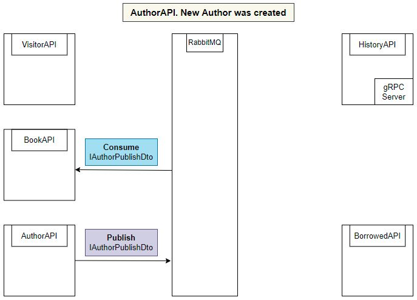
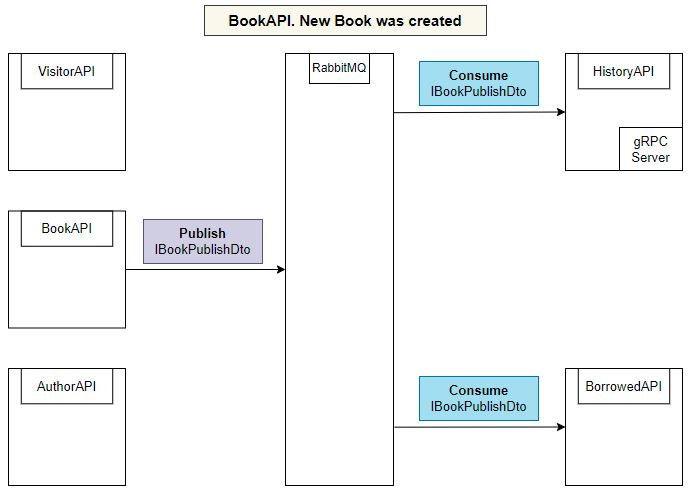
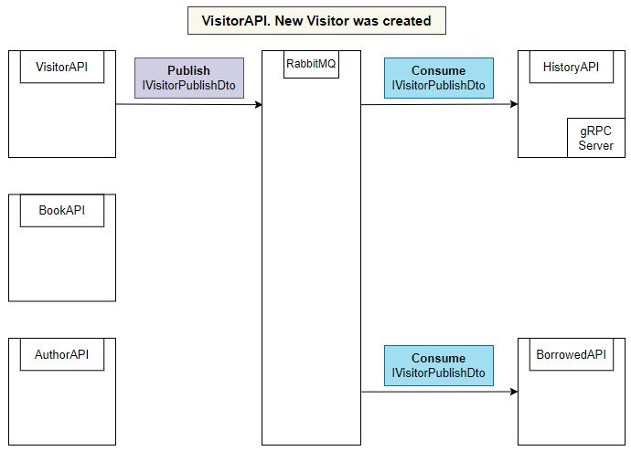
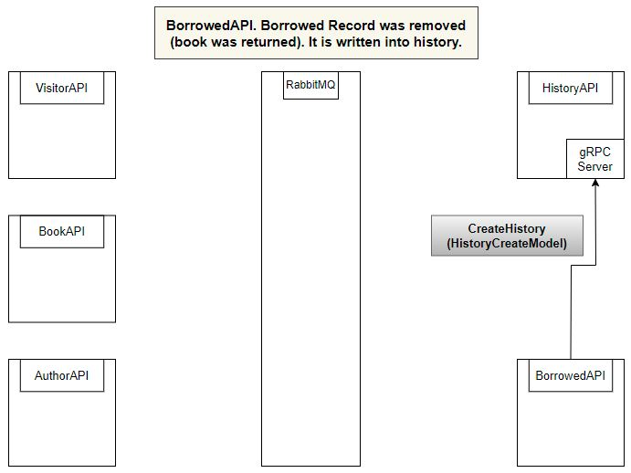

# Library WebAPI Microservices with RabbitMQ and gRPC communication

Solution contains 5 services -
 
- AuthorAPI - a service designed to manage book authors.
- BookAPI - a service designed to manage books.
- VisitorAPI - a service designed to manage library visitors.
- BorrowedAPI - service designed to manage books borrowed by visitors.
- HistoryAPI - service that contains the history of the returned borrowed book.

The solution contains 6 projects. 5 projects - projects for each service. The last project is LibraryTransit.Contract, which contains shared configuration and models for data transfer.

Configuration:
- LibraryTransit.Contract\libraryTransitSharedConfig.json - has Production and Development versions, contains credentials, host, port, and virtual scheme of RabbitMQ server, gRPC endpoint URLs.
- appsetting.json - contains the MassTransit endpoints for the current service and MSSQL database connection string in production variant (inmemory database is used for development)
 
Communication between service
- Service AuthorAPI. After a new Author is created, information about him is published using RabbitMQ and MassTransit. BookAPI consumes it to update the local BookAPIs database.

 
- Service BookAPI. After a new Book is created, information about it is published using RabbitMQ and MassTransit. BorrowedAPI and HistoryAPI consume it to update their local databases.

 
- Service VisitorAPI. After a new Visitor is created, information about him is published using RabbitMQ and MassTransit. BorrowedAPI and HistoryAPI consume it to update their local databases.

 
- Service BorrowedAPI. After the book is returned, the borrowing record is deleted and a history record is created using gRPC.

